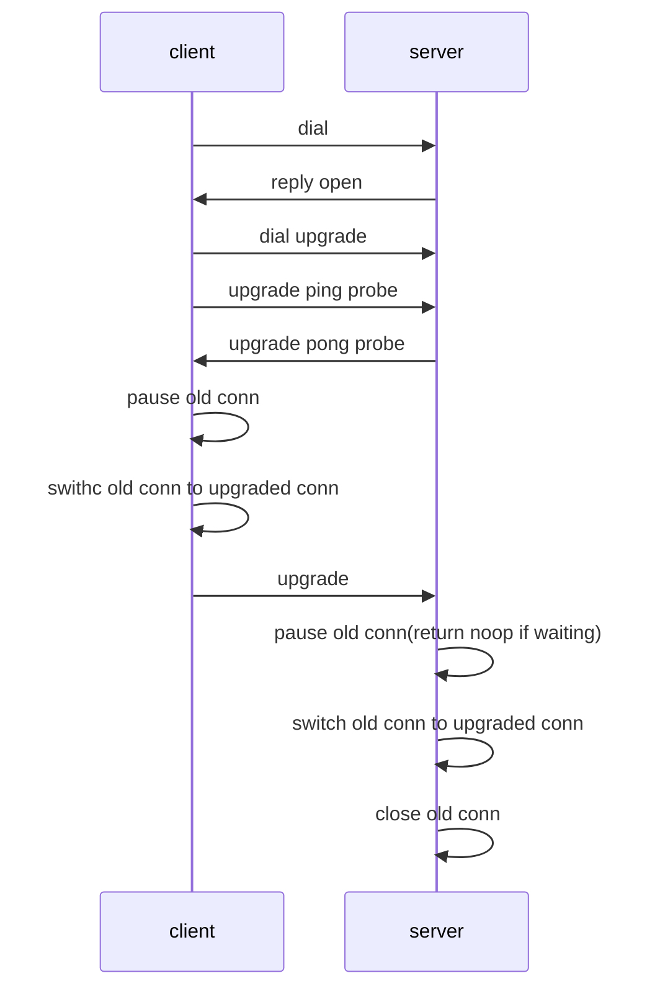

```mermaid
sequenceDiagram
client->>server: dial
server->>client: reply open
client->>server: dial upgrade
client->>server: upgrade ping probe
server->>client: upgrade pong probe
client->>client: pause old conn
client->>client: swithc old conn to upgraded conn
client->>server: upgrade
server->>server: pause old conn(return noop if waiting)
server->>server: switch old conn to upgraded conn
server->>server: close old conn
```
